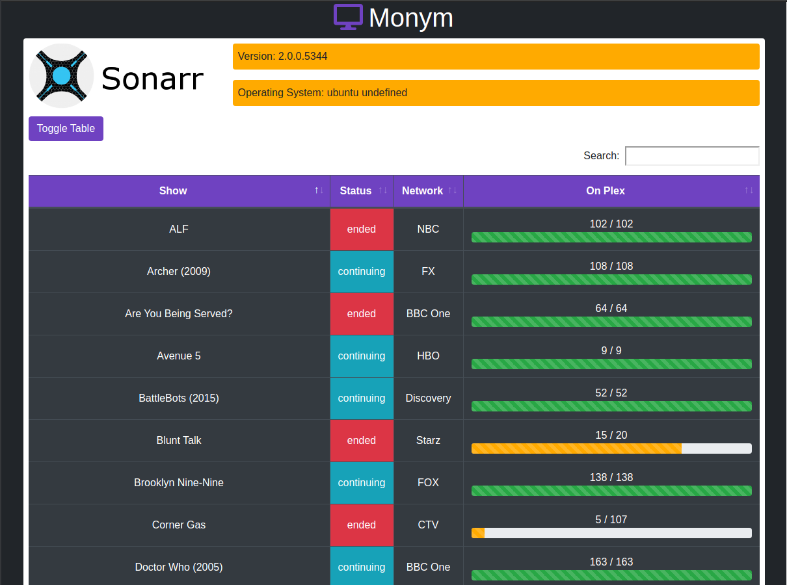

# Monym
 Monitor Your Media is a webapp that is designed to integrate specific aspects of Sonarr, Radarr, and Lidarr to the users who use them. Monym is designed to give limited access to end users.



# The Idea
The Monym project focuses on the end users of various services like Sonarr, Radarr, and others to show the users what is available on the server and what is still in progress.

Since Plex does not show what episodes and movies are missing, without giving everyone access to Sonarr, Radarr etc... it gives them a detailed amount of information, without allowing end users to affect data on the server.

# Installation
In order to install, clone the git repo, and install dependencies with:
```bash
npm i
```
Other than Nodejs, and NPM, no other dependices will be needed.

# Progress Report
- [x] Sonarr TV Series List
- [ ] Radarr Movie List
- [ ] Lidarr Album List
- [x] DataTables
- [ ] Logo Creation
- [ ] Docker Implementation
- [x] Configuration
- [ ] Download Status
- [x] Better Optimization
- [ ] Error Checking